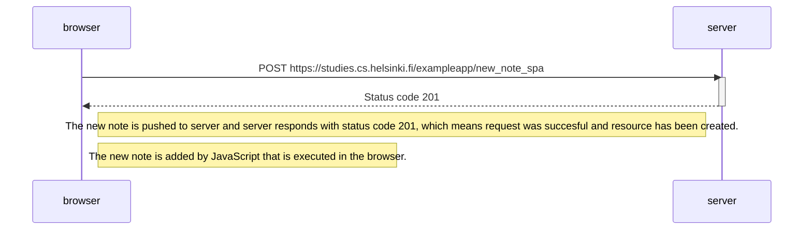

Diagram depicting the situation where user creates a new note on a spa page and clicks submit:

```mermaid
sequenceDiagram
    participant browser
    participant server
    
    browser->>server: POST https://studies.cs.helsinki.fi/exampleapp/new_note_spa
    activate server
    server-->>browser: Status code 201
    deactivate server
    Note right of browser: The new note is pushed to server and server responds with status code 201, which means request was succesful and resource has been created.
    Note right of browser: The new note is added by JavaScript that is executed in the browser.
    

```
